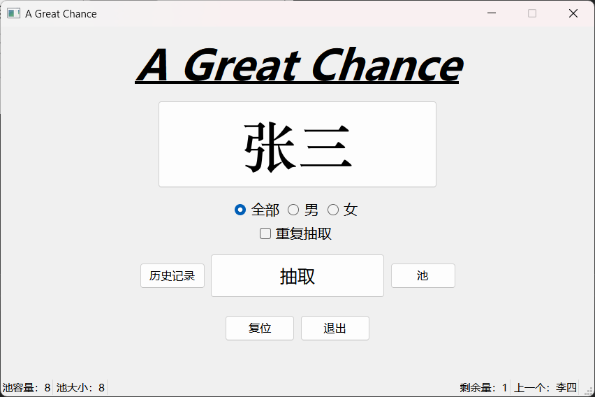

# AGreatChance
一个基于随机数生成器的简易抽签程序

## 随机池

格式：**姓名 + 性别代号（男=0；女=1）** 为一组数据，每组数据占行一，每个数据占一个的单元格。

创建：可使用 Microsoft Excel 或其它合适的工具在程序所在目录下创建一个名为 `pool.csv` 的**逗号分隔值文件**然后按指定格式写入数据，也可以下载[这个模板](res/pool.csv)到程序所在目录下，再修改后使用。

修改：使用 Microsoft Excel 或其它合适的工具按格式修改文件 `pool.csv` 即可。
